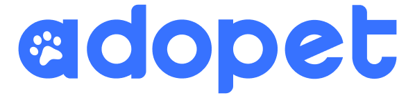

## Alura-Challenge-4

#

#

### Descrição do projeto:

Através do Challenge Based Learning, uma metodologia de ensino que a Apple ajudou a criar,
o desafio nesse challenge é construir a página da empresa fictícia AdoPet.  
A empresa AdoPet têm como objetivo fazer o intermédio entre adotantes de animais e ONGs que possuem foco de retirar animais da rua. Visando isso, ela precisa trazer mais usuários e aumentar a interação entre possíveis adotantes e representantes dessas ONGs e para isso, deseja implementar uma plataforma e levar a empresa pro mundo digital.
  

##### Metodologia

Semanalmente, durante 6 semanas, serão disponibilizado cards com tarefas pelo trello. O layout completo da aplicação foi disponibilizado utilizando o figma.

### Tecnologias utilizadas

Reactjs | Tailwindcss | Typescript
